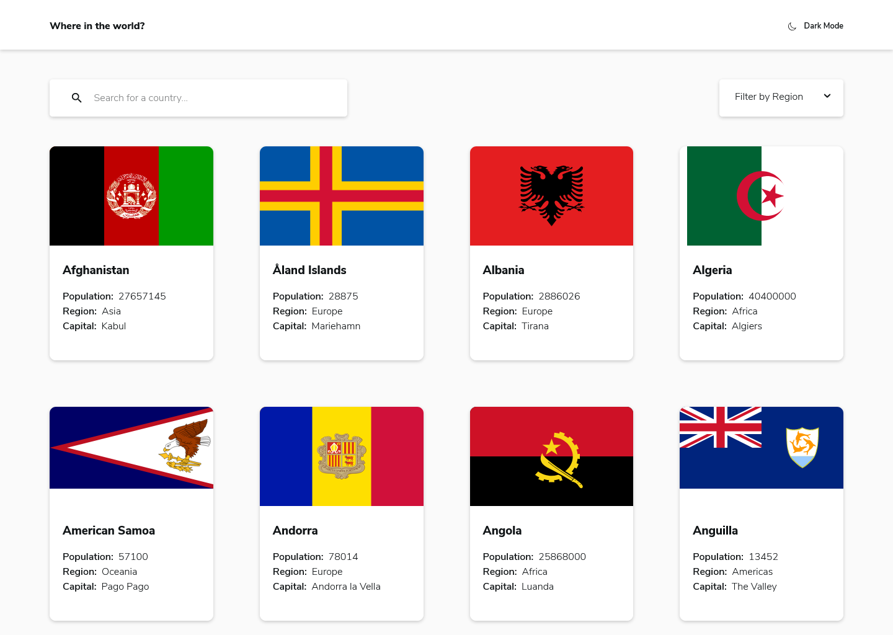
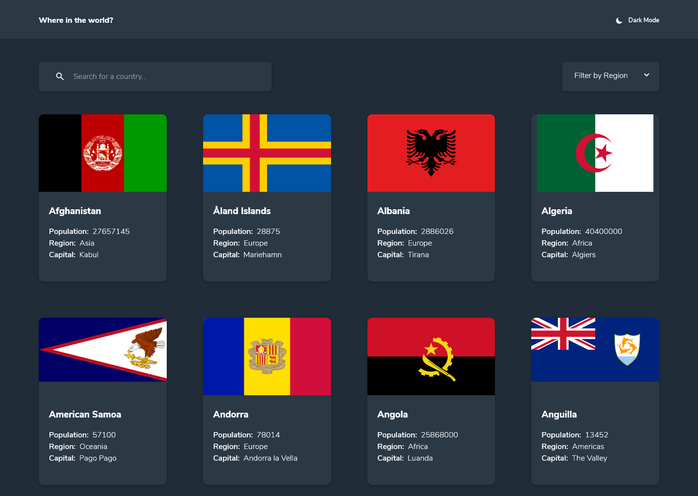
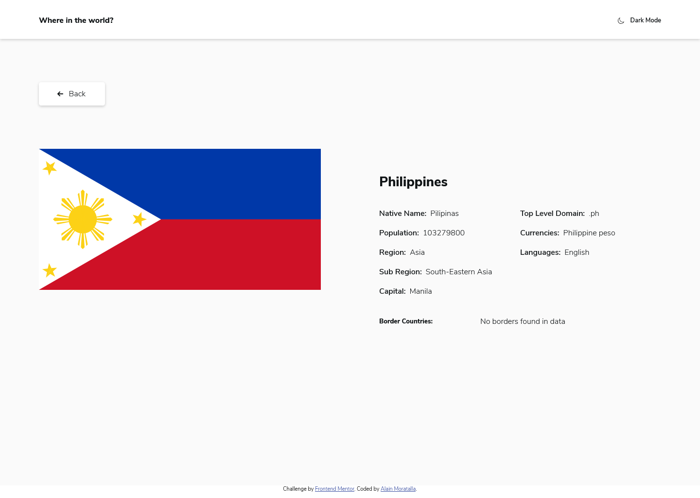
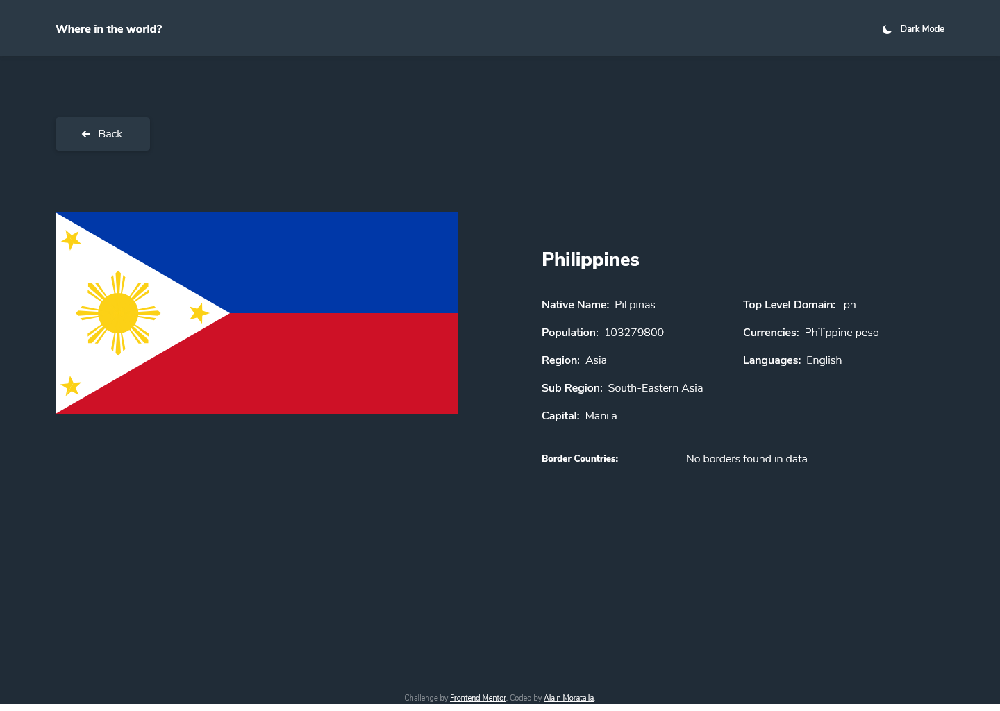
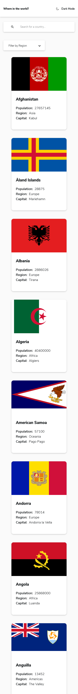
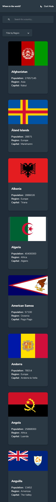
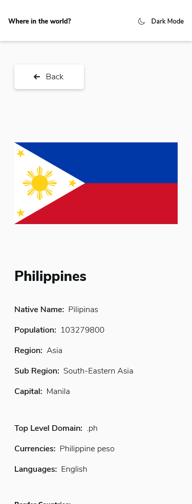
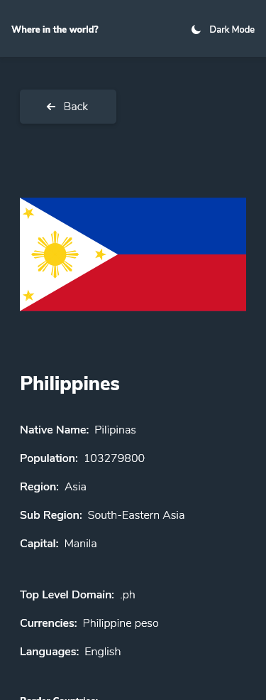

# Frontend Mentor - REST Countries API with color theme switcher solution

This is a solution to the [REST Countries API with color theme switcher challenge on Frontend Mentor](https://www.frontendmentor.io/challenges/rest-countries-api-with-color-theme-switcher-5cacc469fec04111f7b848ca). Frontend Mentor challenges help you improve your coding skills by building realistic projects. 

---
## Table of contents

- [Frontend Mentor - REST Countries API with color theme switcher solution](#frontend-mentor---rest-countries-api-with-color-theme-switcher-solution)
  - [Table of contents](#table-of-contents)
  - [Overview](#overview)
    - [The challenge](#the-challenge)
    - [Screenshot](#screenshot)
    - [Links](#links)
  - [My process](#my-process)
    - [Built with](#built-with)
    - [What I learned](#what-i-learned)
    - [Continued development](#continued-development)
    - [Useful resources](#useful-resources)
  - [Author](#author)
  - [Acknowledgments](#acknowledgments)

---

## Overview
Greetings Everyone! This project is built with React and is made to improve my frontend skills. This challenge is setup by [`Frontend Mentor`](https://www.frontendmentor.io/challenges/rest-countries-api-with-color-theme-switcher-5cacc469fec04111f7b848ca). To know more about this challenge, read the *challenge.md*.

### The challenge

Users should be able to:

- See all countries from the API on the homepage
- Search for a country using an `input` field
- Filter countries by region
- Click on a country to see more detailed information on a separate page
- Click through to the border countries on the detail page
- Toggle the color scheme between light and dark mode *(optional)*

**`Difficulty:`**` Advanced`

### Screenshot

Screen: `1440x1024 light home desktop`

Screen: `1440x1024 dark home desktop`

Screen: `1440x1024 light detail desktop`

Screen: `1440x1024 dark detail desktop`

Screen: `375x3305 light home mobile`

Screen: `375x3305 dark home mobile`

Screen: `375x985 light detail mobile`

Screen: `375x985 dark detail mobile`

### Links

- Solution URL: [Github repo url](https://github.com/almoratalla/REST-Countries-API-with-color-theme-switcher)
- Live Site URL: [My github page](https://almoratalla.github.io/projects/learning/rest-countries-api-with-color-theme-switcher)

## My process

### Built with

- [React](https://reactjs.org/) - JS library
- Semantic HTML5 markup
- SASS (scss syntax) | Node sass | SCSS Modules
- Flexbox
- CSS Grid
- Mobile-first workflow

### What I learned

This project is built using React. I learned through this project to implement theme switcher without relying on states but rather solely on scss and css custom properties to implement theme switching. I implemented node sass within this React project instead of styled components because I was more inclined in separating css/stylesheet codes in a separate file, excluded from the Javascript code.

I've also implemented a modular approach to styling in React where components would access one specific scss style which is tied to its corresponding scss file making it more manageable and structurally organized.

For React, I decided to structure containers separately from components to manage state separately. I also initially wanted to add context api but decided against it when it wasn't needed to transfer state through each component.

Lastly, for sizes relative to the original design, I estimated the sizes by pasting the `jpg` file into AdobeXD and eyeballed its dimensions. 

### Continued development

For further development, one of the good things to add in this project is to utilize the rest countries api more and add the other properties from the response that are not included in the design. Also caching may also be implemented if backend will not be applied so that the API would not be recklessly consumed every time a container needs to trigger a fetch update.

### Useful resources

- [Frontendmentor.io](https://www.frontendmentor.io/resources) - Frontendmentor itself has a list of great resources!.
- [MDN Web Docs](https://developer.mozilla.org/en-US/docs/Web/CSS/Reference) - Great reference for syntax and properties.
- [CSS Tricks! - Flexbox](https://css-tricks.com/snippets/css/a-guide-to-flexbox/) - Something I go back to as a reference for flexbox.
- [CSS Tricks! - Grid](https://css-tricks.com/snippets/css/complete-guide-grid/) - Reference I used in this project for CSS Grid.
- [Google Everything](https://www.google.com/) - You don't know something? Google it! Or any search engine that you prefer. I just mainly use it to go to Stack Overflow lol
- [Stack Overflow](https://stackoverflow.com/) - the ever loving and benevolent!
- [Design Course Vid for Toggle Mode](https://www.youtube.com/watch?v=ZKXv_ZHQ654) - This is my main reference for theme switcher
- [React](https://reactjs.org/) - All you need for the best frontend framework
- [NPM](https://www.npmjs.com/) - Reference for the library of modules on your project that you rarely read.
- [SASS](https://sass-lang.com/) - Buffed styling is best styling
- [REST Countries API](https://restcountries.eu/) - Read the api docs, support this project.
- [IcoMoon](https://icomoon.io) - great reference for icons

## Author

- Website - [Alain Moratalla](https://github.com/almoratalla)
- Frontend Mentor - [@almoratalla](https://www.frontendmentor.io/profile/almoratalla)
- Twitter - [@almoratalla](https://twitter.com/almoratalla)

## Acknowledgments

I tip all the hats in the world for FrontEnd Mentor for giving these challenges. I would also like to thank all the references I used for this project and all resources such as icons that I used in this project. Thank you very much.